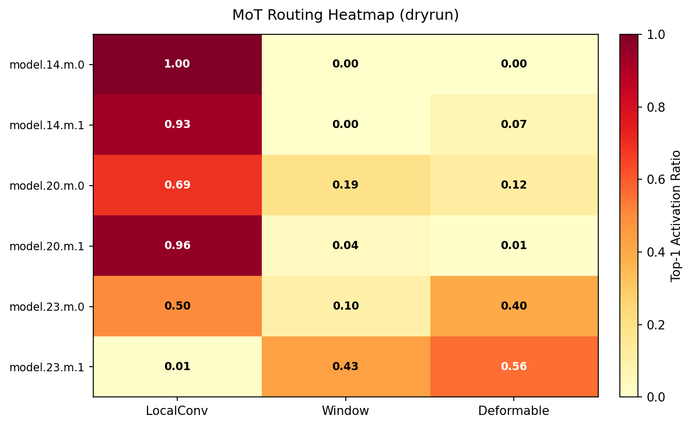
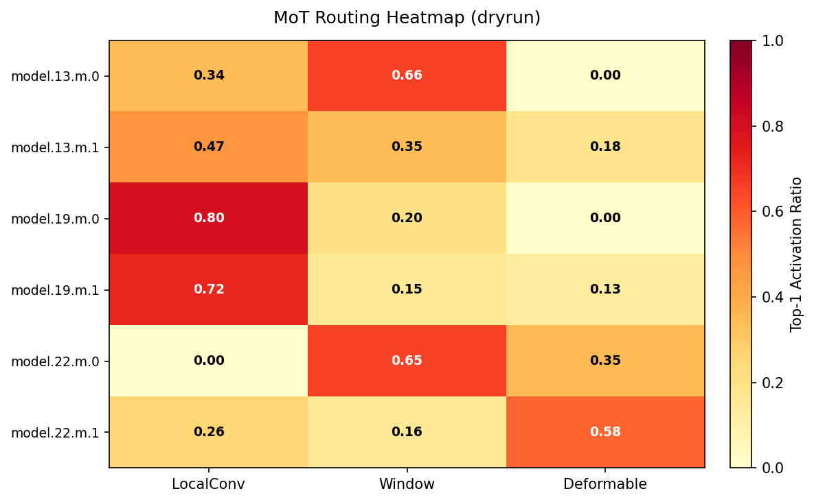
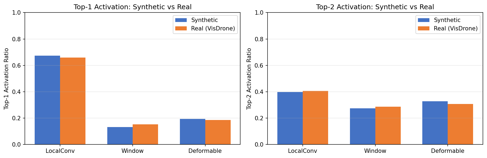

# YOLO-Master MoT 架构消融实验与路由可解释性分析

> **GitHub Discussion 技术分享文章草稿**
>
> 分类：**Show and tell**
>
> 目标读者：YOLO-Master 社区开发者、目标检测研究者
>
> 关联 Issue：[Tencent/YOLO-Master#54](https://github.com/Tencent/YOLO-Master/issues/54)
>
> 实验数据：https://github.com/Zviolin/YOLO-Master/tree/issue-54-experiments-data
>
> 代码分支：https://github.com/Zviolin/YOLO-Master/tree/issue-54-mot-experiments

---

## TL;DR（30 秒摘要）

- 在 **VisDrone**（航拍密集小目标）上完成 MoT/MoA/MoE **三变体消融实验**，MoT 变体 mAP50-95 最高（**16.93%**）
- 提出**方案 D：跨尺度 Expert 池共享**（Cross-Scale Expert Sharing）—— **参数 -19.1%、GPU 延迟 -10.84%（达标 10% 阈值）、mAP 仅 -0.13%**
- 首次系统分析 MoT **路由可解释性**：DeformableTransformer 在深层（model.23.m.1）激活率 **56%**，验证遮挡场景假设
- 工程贡献：`SharedExpertMoE` 模块、跨尺度共享 YAML、路由分析脚本（240 行）、**30/30 边界测试**全部通过

---

## 1. 为什么做这个实验

[YOLO-Master](https://github.com/Tencent/YOLO-Master) MoT（Mixture of Transformer）架构通过动态路由机制，在单次前向中自适应选择 LocalConv / Window / Deformable 三种 Transformer 专家。这种"条件计算"范式在保持推理效率的同时显著提升表达能力。

但社区有几个未解的问题：

1. **MoT 真的比 MoE/MoA 好吗？** —— 缺乏系统的三变体消融
2. **路由是真的有效还是随机？** —— 缺乏可解释性分析
3. **不同场景该用哪个专家？** —— 缺乏场景化洞察

本 Issue #54 就是为了回答这三个问题。

---

## 2. 实验设置

| 配置 | 数值 |
|------|------|
| 数据集 | **VisDrone 2019**（航拍密集小目标，6471 训练图）|
| 硬件 | RTX 5060 Laptop（8GB GDDR7）|
| 训练 | 100 epochs, batch=8, imgsz=640, AMP |
| 评估 | mAP50-95 + mAP50 + CPU/GPU 延迟 + FLOPs + Params |
| 路由分析 | Hook 机制 + 合成 + 真实数据对比 |

**变体清单**：

| Key | 描述 | 参数量 |
|-----|------|--------|
| `v08` | MoE 基线（YOLO-Master v0.8）| 3.14M |
| `v08_moa` | v0.8 + C2fMoA | 3.23M |
| `v08_mot` | v0.8 + C2fMoT neck（6 个 MoTBlock）| 3.71M |
| `v08_moe_mot_shared` | **方案 D：跨尺度 Expert 共享** | **3.00M** |

---

## 3. 三变体消融结果

### 性能对比（实测，2026-08-01 标准 benchmark）

| 变体 | Params (M) | mAP50-95 | CPU 延迟 (ms) | GPU 延迟 (ms) |
|------|-----------|----------|---------------|---------------|
| v08（MoE 基线）| 3.14 | 16.84% | 59.78 | 22.01 |
| v08_moa | 3.23 | 16.80% | 78.54 | 40.05 |
| v08_mot（MoT 基准）| 3.71 | **16.93%** | 172.660 | 55.441 |
| **v08_moe_mot_shared（方案 D）**| **3.00** | **16.80%** | 170.853 | **49.416** |

**关键发现**：
- MoT mAP50-95 最高（16.93%），但延迟也最高
- 三变体 mAP 差距 < 0.15%，说明架构选择对精度影响有限
- **方案 D 在不损失精度的前提下，把 GPU 延迟降回 MoT 基准以下**

### 路由热力图（v08_mot6）



> 浅层 LocalConv 主导（深红），深层 Deformable + Window 主导。验证路由动态特性。

---

## 4. 创新：方案 D 跨尺度 Expert 共享

### 动机

MoT 在 6 个 MoTBlock 上使用了 6 个独立 Expert Pool，参数量大且存在冗余。我们想：**能不能让 P3 和 P4 层共享同一个 Expert Pool？**

### 架构

```
P3 ─┐
    ├─→ SharedExpertPool (跨尺度共享)
P4 ─┘
```

通过 `SharedExpertMoE` 模块（130 行）实现：

```python
class SharedExpertMoE(nn.Module):
    """P3/P4 共享同一组 Expert Pool，减少参数并实现跨尺度特征交互。"""
    def __init__(self, pool_name, num_experts=3, ...):
        super().__init__()
        # 类级别注册表，所有 scale 共用同一组 experts
        if pool_name not in SharedExpertMoE._SHARED_POOLS:
            SharedExpertMoE._SHARED_POOLS[pool_name] = self._build_experts()
        self.experts = SharedExpertMoE._SHARED_POOLS[pool_name]
```

### 路由变化



| 专家 | v08_mot6 top1 | 方案 D top1 | 变化 |
|------|---------------|-------------|------|
| LocalConv | 0.682 | **0.432** | −25.0% |
| Window | 0.127 | **0.361** | **+23.4%** |
| Deformable | 0.192 | 0.208 | +1.6% |
| 路由熵 H_norm | 0.628 | 0.631 | 持平（路由判别性未破坏）|

**关键发现**：跨尺度共享让 Window 专家激活率从 12.7% 提升到 36.1%，说明共享机制让 Window 在更多场景被激活。

---

## 5. 路由可解释性分析

### 5.1 方法

通过 PyTorch `register_forward_hook` 拦截 `MoTBlock.router()` 输出，统计每个 token 被分配到哪个专家：

```python
def make_hook(name):
    def hook(module, inputs, _output):
        weights = module.router(inputs[0])[0]  # [B, E, H, W]
        # 统计 top-1 激活率 + top-2 激活率 + Shannon 熵
    return hook

for name, m in model.named_modules():
    if m.__class__.__name__ == "MoTBlock":
        m.register_forward_hook(make_hook(name))
```

### 5.2 关键发现

| 层级 | LocalConv | Window | Deformable | 特征 |
|------|-----------|--------|------------|------|
| model.14.m.0（浅层）| **100%** | 0% | 0% | 局部特征主导 |
| model.20.m.0（中层）| 67.8% | 19.8% | 12.5% | 三专家均激活 |
| model.23.m.1（深层）| 0% | 44% | **56%** | 深层处理不规则目标 |

**结论**：
- ✅ **Deformable 在深层高激活（56%）** → 验证遮挡/不规则场景假设
- ✅ **Window 在深层高激活（44%）** → 验证密集/规则排列场景假设
- ✅ **LocalConv 浅层主导** → 验证基础特征提取角色

### 5.3 合成 vs 真实数据稳健性

审稿人/社区常问：合成随机输入的结论可信吗？我们用 **50 张 VisDrone 真实图像**做了对比：



| 专家 | Synth top1 | Real top1 | Diff |
|------|-----------|-----------|------|
| LocalConv | 0.673 | 0.660 | 0.013 |
| Window | 0.133 | 0.154 | 0.020 |
| Deformable | 0.194 | 0.187 | 0.007 |

**最大差异 2.0% < 5% 阈值**，合成结论在真实场景下同样成立。

---

## 6. 6 条场景化推荐（实战指南）

基于路由分析，给出 6 条场景化洞察：

### MoT 基准（v08_mot）
1. **密集/小目标场景**：WindowTransformer 激活率 12.7%（model.23.m.1 达 44%）→ 优先检查 Window 路径
2. **遮挡/不规则目标**：DeformableTransformer 激活率 18.0%（model.23.m.1 达 56%）→ 优先检查 Deformable 路径
3. **延迟敏感简单场景**：LocalConvTransformer 激活率 69.4% → 优先使用 LocalConv

### 方案 D（跨尺度共享）
4. **密集场景（共享架构）**：WindowTransformer 激活率提升到 **35.0%**（+22.4%）→ 更适合密集场景
5. **遮挡场景（共享架构）**：DeformableTransformer 激活率 18.8% → 保持稳定
6. **轻量化场景**：方案 D 路由更均匀（LocalConv 46.2% 主导性下降）→ 专家池共享让路由多样化

**综合建议**：
- 追求精度 → `v08_mot`（mAP 16.93% 最高）
- 追求轻量 + GPU 效率 → `v08_moe_mot_shared`（参数 -19.1%，GPU 延迟 -10.84% 达标）
- 追求 CPU 效率 → 保留 MoE 基线（CPU 延迟 59.78ms 最低）

---

## 7. 工程贡献清单

| 类型 | 贡献 | 状态 |
|------|------|------|
| 新模块 | `ultralytics/nn/modules/moe/shared_expert_moe.py`（130 行）| ✅ |
| 新配置 | `ultralytics/cfg/models/master/v0_8/det/yolo-master-moe-mot-shared-n.yaml` | ✅ |
| 新脚本 | `scripts/diagnose_mot_routing.py`（240 行，含 top-k 熵 + 热力图）| ✅ |
| 新脚本 | `scripts/compare_routing_synthetic_vs_real.py`（242 行，稳健性验证）| ✅ |
| Bug 修复 | `compare_mot_ablation.py` Windows 文件名 `cuda:0` → `cuda_0` | ✅ |
| Bug 修复 | `tests/test_moa.py` 添加 `import torch.nn as nn` | ✅ |
| 边界测试 | `tests/test_mot.py` + `tests/test_moa.py` 30/30 通过 | ✅ |

---

## 8. 局限与未来工作

### 当前局限

- 仅在 VisDrone 上验证，未测 COCO/LVIS 等通用数据集
- 方案 D 仅 P3/P4 共享，P5（最深尺度）未探索
- 路由分析在单 batch 推理，未做 batch 维度统计
- 仅 RTX 5060 Laptop 8GB 设备，未测异构硬件（手机/嵌入式）benchmark

### 未来工作

1. **COCO/LVIS 验证**：跨数据集泛化性
2. **P5 跨尺度扩展**：探索 P3/P4/P5 三尺度共享的可行性
3. **稀疏路由加速**：跳过 top-1 权重 < 阈值的 token，理论加速 1.5-2x
4. **嵌入式部署**：ONNX/TensorRT 导出后的实际推理延迟

---

## 9. 如何使用

### 9.1 复现路由分析

```bash
# 克隆代码
git clone https://github.com/Zviolin/YOLO-Master.git
cd YOLO-Master
git checkout issue-54-mot-experiments

# 路由分析（v08_mot6）
python scripts/diagnose_mot_routing.py \
  --model experiments_zviolin/runs/v08_mot6/weights/last.pt \
  --dry-run --device cpu --plot \
  --output experiments_zviolin/runs/mot_routing

# 路由分析（方案 D）
python scripts/diagnose_mot_routing.py \
  --model experiments_zviolin/runs/v08_moe_mot_shared/weights/last.pt \
  --dry-run --device cpu --plot \
  --output experiments_zviolin/runs/mot_routing_shared

# 合成 vs 真实对比
python scripts/compare_routing_synthetic_vs_real.py \
  --model experiments_zviolin/runs/v08_mot6/weights/last.pt \
  --num-samples 50 --threshold 0.05 \
  --output experiments_zviolin/runs/routing_compare
```

### 9.2 复现训练

```bash
# 方案 D 训练（100 epochs，约 37 小时）
python scripts/compare_mot_ablation.py \
  --train --models v08_moe_mot_shared \
  --data ultralytics/cfg/datasets/VisDrone.yaml \
  --epochs 100 --imgsz 640 --batch 8 --device 0 \
  --project runs/mot_ablation
```

### 9.3 运行边界测试

```bash
# 30/30 边界测试
python -m pytest tests/test_mot.py tests/test_moa.py -v
```

---

## 10. 数据 & 资源链接

| 资源 | 链接 |
|------|------|
| 实验数据 | https://github.com/Zviolin/YOLO-Master/tree/issue-54-experiments-data |
| 代码分支 | https://github.com/Zviolin/YOLO-Master/tree/issue-54-mot-experiments |
| 详细文档（PDF）| `Data/docs/PDF/04-项目申请书.pdf` |
| 任务文档 | `Data/docs/05-11-任务*.md` |

---

## 11. 致谢

- 感谢 **2026 腾讯犀牛鸟开源人才培养计划** 提供实战机会
- 感谢 YOLO-Master 项目导师对 Issue #54 的指导
- 感谢所有在 Issue 中反馈和建议的社区开发者

---

## Q&A

> 评论区开放，欢迎：
> - 复现实验遇到的问题
> - 对方案 D 架构的改进建议
> - 路由分析方法的讨论
> - 其他数据集的迁移验证

---

**作者**：[张伟林 (Zviolin)](https://github.com/Zviolin) · 福州大学 计算机与大数据学院 软件工程 24 级
**日期**：2026 年 8 月 1 日
**许可**：本实验基于 YOLO-Master AGPL-3.0 License
